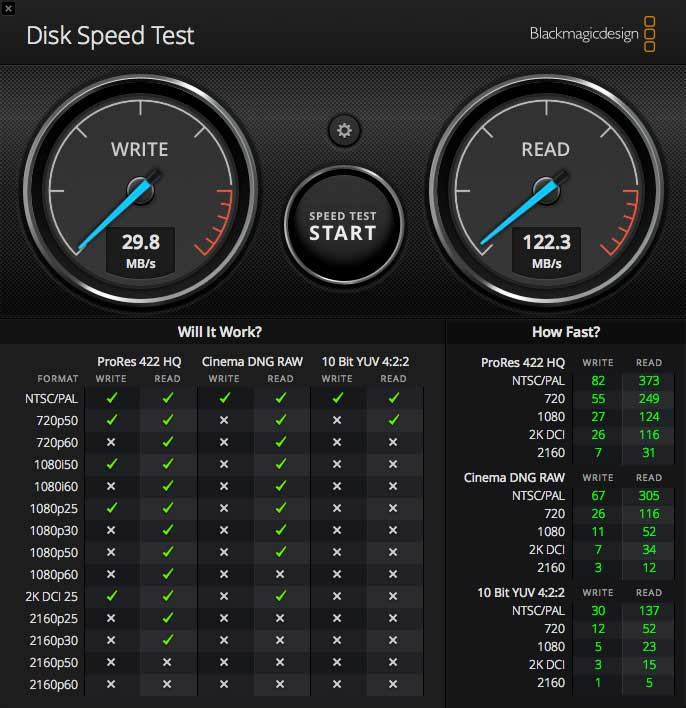

# Mapa de puertos USB

Aquí está el mapa de puertos USB para la placa madre Gigabyte Aorus z390 I Pro Wifi, fue descubierto gracias a una excelente herramienta [USBMap script](https://github.com/corpnewt/USBMap).

 * **HS01/SS01:** Panel Frontal USB Type-C™ port, con USB 3.1 Gen 1 (F_USB30C)
 * **HS02/SS02:** Desconocido
 * **HS03/SS03:** Panel Posterior USB 3.1 (azul)
 * **HS04/SS04:** Panel Posterior USB 3.1 (azul, alado de conexion Ethernet)
 * **HS05/SS05:** Panel Posterior USB 3.1 Gen 2 Type-A (rojo, alado de USB Type-C)
 * **HS06/SS06:** Panel Posterior USB Type-C™ port, con USB 3.1 Gen 2 (alado de Usb Rojo)
 * **HS07/SS07:** Panel Posterior USB 3.1 Gen 1 (azul)
 * **HS08/SS08:** Panel Posterior USB 3.1 Gen 1 (azul)
 * **HS09/SS09:** Panel Frontal USB 3.1 Gen 1 (atraves de F_USB30)
 * **HS10/SS10:** Panel Frontal USB 3.1 Gen 1 (atraves de F_USB30)
 * **HS11/SS11:** Desconocido
 * **HS12:** interno USB 2.0/1.1 (F_USB1)
 * **HS13:** interno USB 2.0/1.1 - ITE Device(8595)
 * **HS14:** interno Bluetooth/Wifi
 * **USR1:** Desconocido
 * **USR2:** Desconocido

## Puertos que quiero mantener habilitados:
 * HS03
 * HS04/SS04
 * HS05/SS05
 * HS07/SS07
 * HS08/SS08
 * HS09/SS09
 * HS10/SS10
 * HS12
 * HS13
 
**Total:** 15 puertos (no necesito más)

### Estaría deshabilitando lo siguiente: ###
 * El puerto USB type-C en el panel posterior ya que no tengo dispositivos type-c
 * la conexion a USB Type-C para el panel frontal, ya que mi gabinete no tiene usb type-c adelante (Evolv ITX)
 * HS02/SS02 (nose en que parte esta ubicado)
 * SS03 No sirve tener Usb 3.1 en donde conecto el teclado o el raton, por ello solo lo dejo como Usb 2.0
 * Bluetooth/Wifi (debido a que no funciona en hackintosh)
 * USR1/USR2 (no se donde a que se refiere)

## Como utilizar este mapeo

Para utilizarlo simplemente reemplaza el kext USBInjectAll.kext por USBMap.kext. Ten en cuenta que deshabilitaras los puertos type-C, este mapeo es particularmente para mi uso, 
Te recomiendo que crees tu propio mapa con la herramienta arriba,

## Conclusión
Es genial ya que no tienes que colocar mas codigo para las limitaciones de 15 puertos, porque con este mapeo solo utilizarás 15, no necesitas mas. Ademas las velocidades de USb 3 se ven claramente. dejo a continuacion una prueba con los usb frontales, como pueden ver lecturas de 150Mb/s aprox, los Usb2.0 llegan a 20Mb/s aprox. 

