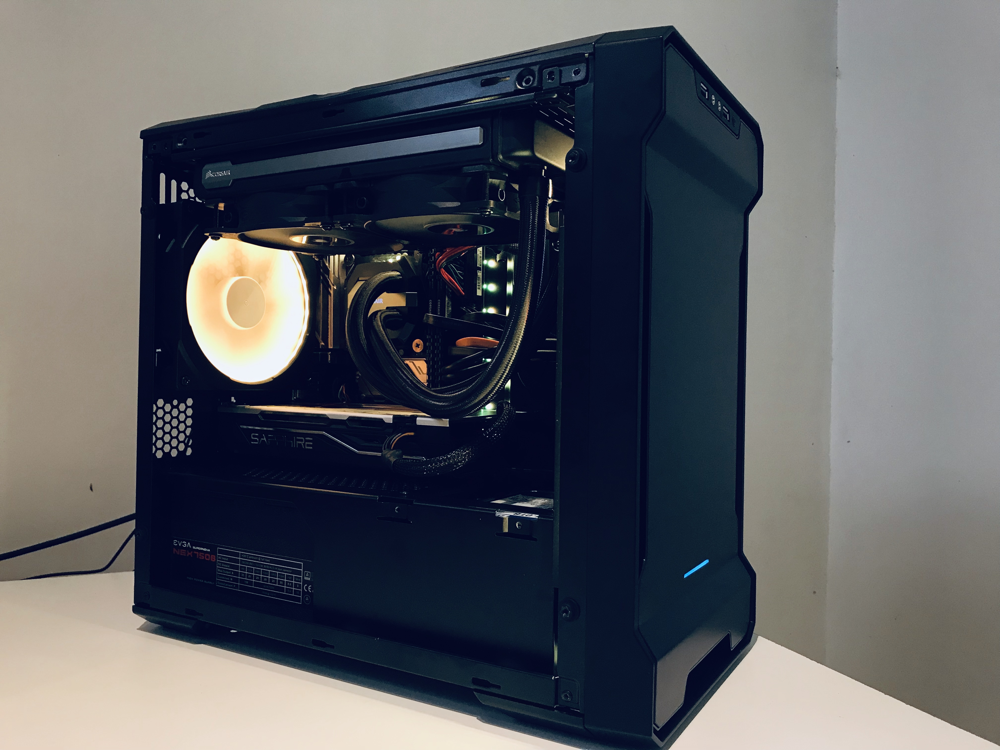
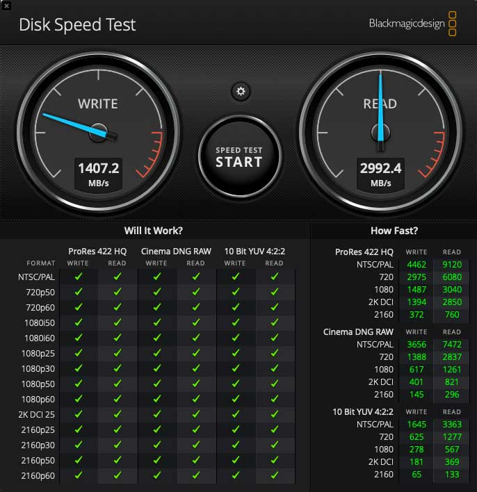

# PYnty-Mac - Hackintosh-Gigabyte-Z390-I-Aorus-Pro-Wifi
Esta es una guia para construir un hackintosh con una placa madre Gigabyte z390 I Aorus pro wifi, es el formato mini itx.

Esta es mi tercera build. Me alegro de que funcione bien, al principio, pensé en la adquisición de la i9-9900K o el i7-8700K. Pero, primero quería empezar con el i7-8700, y, luego actualizarlo como la placa base me permite.

### Hardware que utilice
- Phanteks Enthoo Evolv ITX Tempered Glass
- Gigabyte Z390 I AORUS PRO WIFI Motherboard
- Intel Core i7-8700 Processor
- Corsair Vengeance Pack 32GB (2 x 16GB) DDR4 3000
- SAPPHIRE PULSE Radeon RX 580 8GB
- SAMSUNG 970 EVO M.2 2280 250GB SSD
- EVGA SuperNOVA 750 B1, 80+ BRONZE 750W, Semi Modular
- CORSAIR Hydro Series H100i v2 AIO Liquid CPU Cooler, 240mm
- Crucial MX500 250GB 3D NAND SATA 2.5 Inch Internal SSD

### Lo que funciona
- Aceleracion Grafica con RX 580, que es compatible de forma nativa.
- Intel UHD 630 (Aceleracion Grafica)
- Ethernet integrado
- Audio integrado
- Suspencion, Reactivación, reinicio y apagado. Despertar de la suspencion requiere una pulsación de una tecla.
- Quick Look y Vista Previa
- iMessage, FaceTime, App Store, iTunes.
- TRIM está habilitado en NVMe Samsung sin parches (puedes ver las velocidades en la imagen a continuación realizadas con BlackmagicDesign)

### Lo que no funciona
- Wifi y Bluetooth integrado (Esto no funciona de forma nativa, ya que Gigabyte incorporo el nuevo módulo WIFI con CVNi, cuando Apple lo actualice en sus nuevos MacBooks, seguramente aparecera un adaptador compatible para que podamos incorporar una placa Broadcom.)
- Handoff, Continuity, AirDrop: Estos no funcionan porque WiFi y Bluetooth son necesarios.

### Instrucciones paso por paso
Ver la seccion [instrucciones.md](instrucciones.md)

### Mapeo USB
El mapeo lo limite a 15 puertos usb, los usb3.0 funcionan espectacular. Ver la seccion [Mapeo_Puertos_USB.md](Mapeo_Puertos_USB.md) para ver mas detalles.

### Importante
Eres bienvenido a utilizar mi carpeta EFI. Sin embargo, asegurate de cambiar los siguientes datos en tu config.plist con Clover Configurator:
- SerialNumber
- BoardSerialNumber
- SmUUID

(Al editar config.plist debes cambiar los valores mencionados anteriormente ya que estan vacios, si utilizas clover configurator puedes crearlos aleatoriamente)
