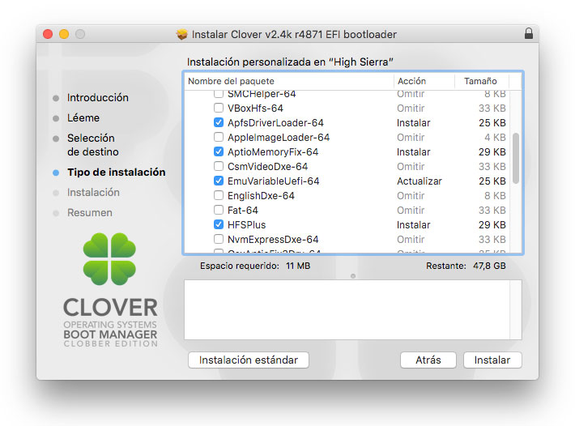

# Instrucciones Paso a Paso

Estas son instrucciones paso a paso para una instalación de "Vanilla" de MacOS Mojave 10.14.3+ en un Gigabyte Aorus I Pro Wifi Z390 con una CPU Intel i7 8700.

## Utilidades que necesitaras
Estas son utilidades para Mac. Por lo tanto, necesita acceso a un Mac real.

* [Unibeast 9.1.0](https://www.tonymacx86.com/resources/categories/tonymacx86-downloads.3/)
* [Clover Installer](https://github.com/Dids/clover-builder/releases)
* [Clover Configurator](https://mackie100projects.altervista.org/download-clover-configurator/)

## Instalando el sistema operativo OsX
El proceso aquí es muy simple solo sigue los pasos.

### 1. Preparar el instalador USB con UniBeast
- Introduce la unidad USB
- Abre /Applications/Utilities/Disk Utility
- Resalta la unidad USB en la columna izquierda (Nota: en la versión de Mojave de la utilidad de discos, primero debes seleccionar ver/Mostrar todos los dispositivos, antes de que pueda ver la unidad USB allí)
- Haz clic en el botón borrar
- Para Nombre: MOJAVE (se puede renombrar más tarde)
- Para Formato: Mac OS Extended (Journaled) y GUID Partition
- Haz clic en borrar y listo
- Descarga e inicia UniBeast
- Click Continuar, Continuar, Continuar, Continuar, Aceptar los terminos (Aqui no me dejaba abrir unibeast porque el idioma de mac tiene que estar en Ingles, pero lo puedes cambiar en las preferencias)
- En seleccinar destino, selecciona USB y click en Continuar
- En la pantalla Seleccionar instalación del sistema operativo, elije Mojave y haz clic en continuar
- click en Continuar, ingresa el password y click Instalar

### 2. Modifica la particion EFI creada en el USB
- Abre la particion EFI del USB, elimina la carpeta EFI/
- Copia y pega mi carpeta EFI
--- Es el método más fácil, pero si aún quieres profundizar más, puedes visitar la opción de instalación de Vanilla, deja el sistema MAC intacto. He visto mucho en esa guia que me ha ayudado para que esta construccion se mantenga estable.
[Guia Vainilla para Coffee Lake](https://hackintosh.gitbook.io/-r-hackintosh-vanilla-desktop-guide/config.plist-per-hardware/coffee-lake)

### 3. Cambios en la BIOS
Mantén pulsado F12 durante el arranque para entrar en el menú de inicio y selecciona Enter Setup para ir a las opciones de la BIOS

#### Opciones
- Save & Exit → Load Optimized Defaults
- M.I.T. → Extreme Memory Profile (X.M.P.): Profile 1
- BIOS → Windows 8/10 Features: Other OS
- BIOS → CSM Support: Disabled
- BIOS → Secure Boot : Disabled
- Peripherals → Intel Platform Trust Technology (PTT) : Disable
- Peripherals → Network Stack Configuration → Network Stack : Disabled
- Peripherals → USB Configuration → Legacy USB Support : Enabled
- Peripherals → USB Configuration → XHCI Hand-off : Enabled 
- Chipset → Vt-d : Disabled
- Chipset → Internal Graphics : Enabled (After changing this and the other options, you must restart to show the two options DMVT)
- Chipset → DVMT Pre-Alloc : 64M
- Chipset → DVMT Total Gfx Mem : 256M
- Chipset → Above 4G Decoding : Enabled (In a restart apparently this option hurts to start and hanged, now is enabled and without problems)

Guardar y salir, el sistema se reiniciará con los datos guardados

### 4. Instalar Mojave
- Reinicia o enciende el equipo
- Mantener pulsado F12 durante el BIOS para entrar en el menú de arranque
- Selecciona tu USB, En las opciones de Clover Click "Install Mojave"
- Cuando el instalador arranque, ingresa a utilidad de discos y formatea "borra" tu SSD, llamalo Mojave OSX por ejemplo. Elije la opción de formato recomendada (Journaled) y la partición GUID.
- Salir de la utilidad de discos
- Instalar Mac OS X
* Si el ordenador se reinicia durante este tiempo, no te desesperes. La instalación tomará un número de reinicios antes de la finalización (3 para ser exactos). A partir de ahora, en cada reinicio presionas F12 e inicias con el USB y seleccionas el disco duro SSD principal en clover, verá las opciones en Clover con el nombre de SSD Mojave OSX (o el nombre que haz elegido).

### 5. Instalar Clover en SSD
Ahora vamos a instalar clover en el SSD para no tener que iniciar siempre del USB.

- Ejecuta el instalador de clover
- Continuar, Continuar, Continuar
- En tipo de Instalacion haz click en "personalizar" y solo selecciona lo siguiente.
    -  Instalacion para arranque UEFI
    -  Instalar clover en la particion ESP
    -  Los temas si quieres puedes dejarlo
    -  En UEFI Drivers, solo ten los 4 principales: 
    

### 6. Finalizando Instalacion
Vamos a reparar el arranque, abriremos Clover Configurator y montamos las carpetas de EFI donde instalamos Mojave (lo creamos al instalar clover en el paso anterior)

- Abre Clover Configurator
- Mount EFI → SSD → Mount Partition
- Mount EFI → SSD → Open Partition
- Mount EFI → USB Stick → Mount Partition
- Mount EFI → USB Stick → Open Partition
- Copia todo el contenido del USB, especificamente la carpeta EFI al volumen SSD EFI (elimina la carpeta EFI del SSD. Copia y pega la carpeta EFI del USB)

Y eso es todo, deberias poder iniciar perfectamente desde el ssd donde esta instalado Mojave..

## Kexts Importantes Utilizados
Todos los kexts deben copiarse en`/EFI/CLOVER/kexts/Other`. Siempre que copie kexts desde una fuente en línea, asegúrate de copiar la versión **Release**.

* [USBInjectAll.kext](https://bitbucket.org/RehabMan/os-x-usb-inject-all/downloads/)
    - This is necessary to exclude our onboard Bluetooth adapter (HS14).
* [IntelMausiEthernet.kext](https://bitbucket.org/RehabMan/os-x-intel-network/downloads/)
    -  Esto es para nuestro Ethernet/LAN integrado
* [Lilu.kext](https://github.com/acidanthera/Lilu/releases)
    -  Kext arbitrario y parches de proceso en macOS
* [WhateverGreen.kext](https://github.com/acidanthera/WhateverGreen/releases)
    -  Varios parches en un solo paquete para ciertas GPU ATI/AMD/Intel/NVIDIA

## Otros Kexts
Estos son kexts que no estoy utilizando, pero que podrían ser útiles para ti dependiendo del hardware que estes armando.

* [NoVPAJpeg.kext](https://github.com/vulgo/NoVPAJpeg/releases)
    - Este es un kext que puede utilizar si tiene problemas con QuickLook/vista previa. iGPU se sabe que no siempre funciona correctamente en las placas madres Z390. Pude conseguir mi iGPU (sin cabeza) para trabajar correctamente, así que no necesito esto.
* [VirtualSMC.kext](https://github.com/acidanthera/VirtualSMC/releases)
    - Emulador de SMC avanzado para Apple. Si bien hay casos en los que el sistema esta estable, pero si tienen panic kernel o apagados, no estaria mal colocar este kexts en tu lista.

## Gracias a..
* [la guía de instalación de Vanilla de Hackintosh](https://hackintosh.gitbook.io/-r-hackintosh-vanilla-desktop-guide/)
* [La comunidad de Tonymacx86](https://www.tonymacx86.com/)

## A Futuro
Creo que esta guía aun esta incompleta. Muchos lo han utilizado con éxito ya que falta dejar wifi y bluetooh nativos y funcionando. Actualizaré continuamente estos documentos según sea necesario aunque yo en particular tengo el sistema estable y trabajando con el continuamente sin problemas.
